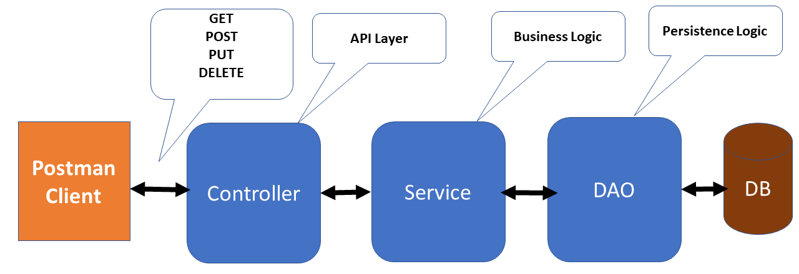
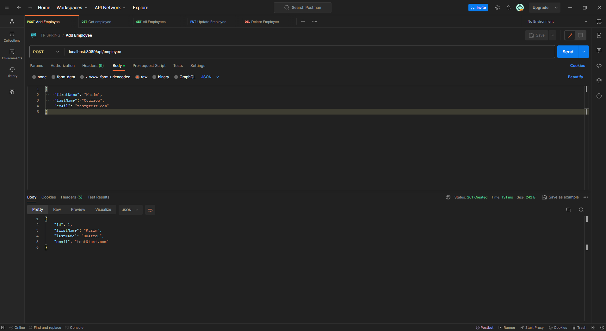
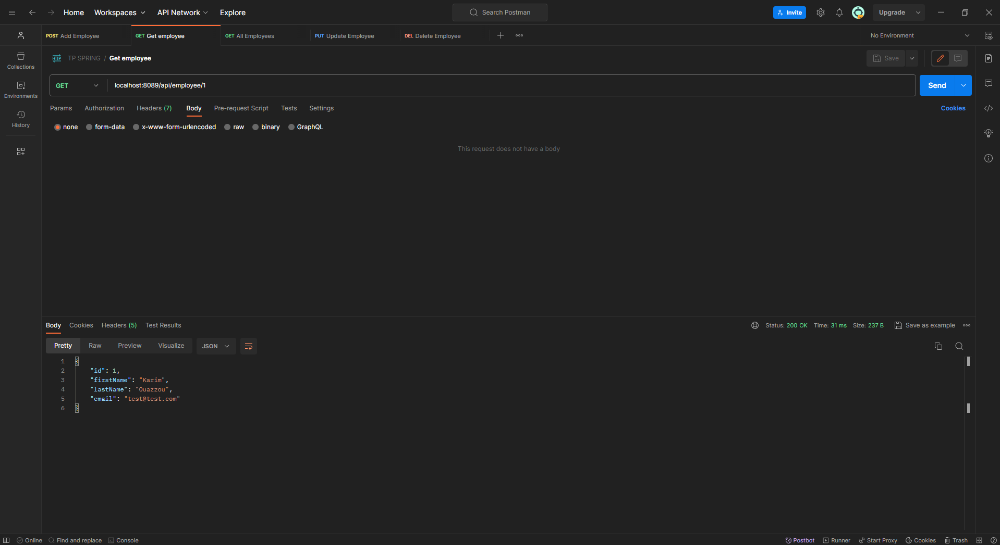
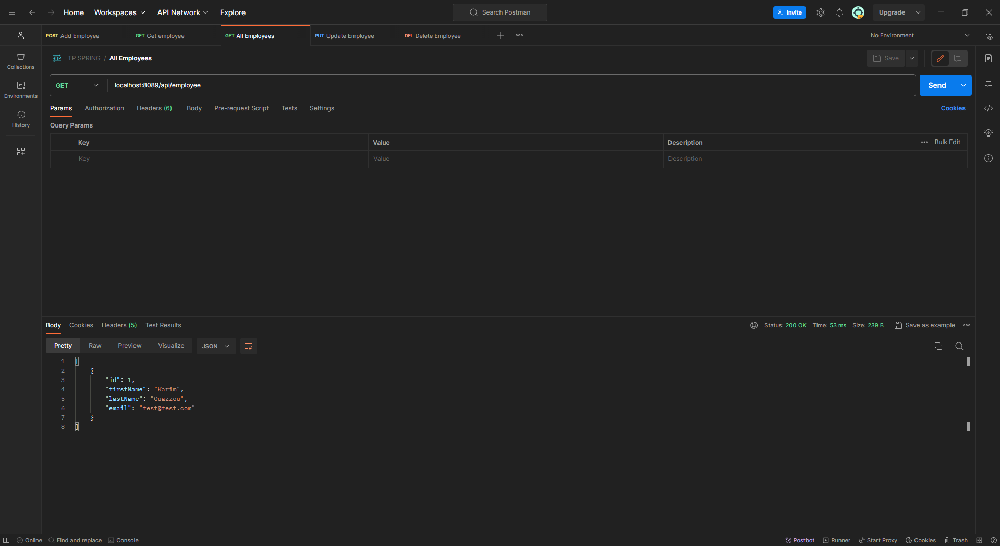
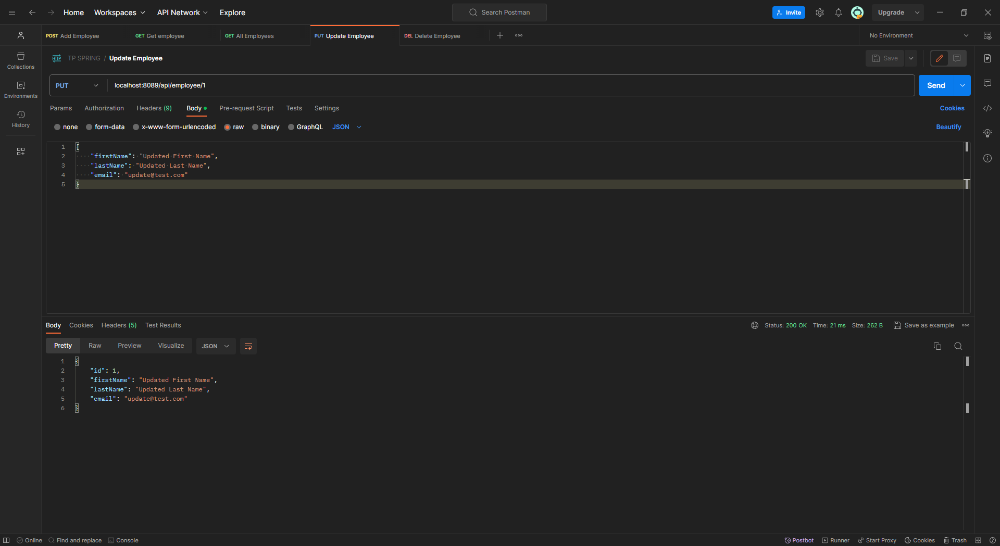
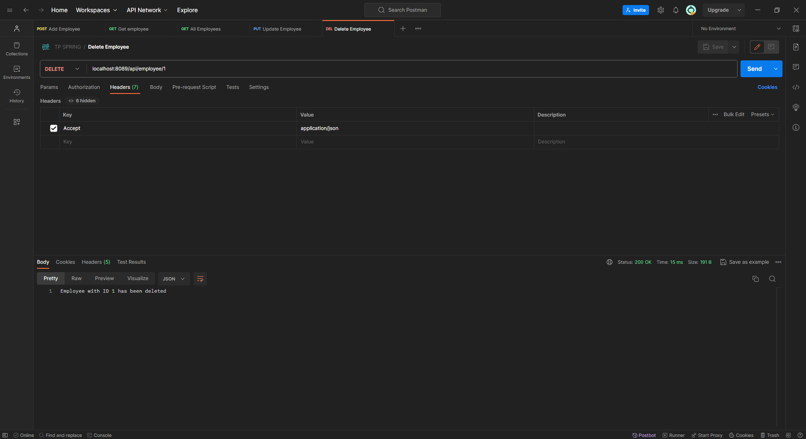

<h3 align="center">Practical Exercise</h3>

## About The Project
Spring Boot CRUD REST APIs with Hibernate and MySQL Database

## Tools and technologies used: 
• Java 17 • Maven • Spring Boot 3 • Spring Data JPA (Hibernate) • Lombok • Tomcat • MySQL • Postman •
## Architecture
<h4 align="center">three-layer architecture</h3>

## Preview
- Add Employee

- Get Employee

- All Employees

- Update Employee

- Delete Employee

